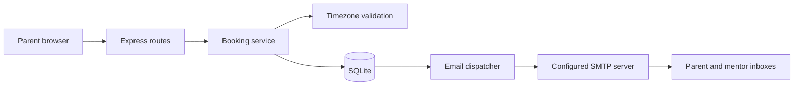

# Engineering decisions and review guide

This document explains the implemented behavior and its tradeoffs. It is a companion to the source and tests, not a claim that generated code was written without AI. The actual collaboration is recorded in `TRANSCRIPT.md`.

## Product research

Reviewed on 25 September 2026:

- [Codeyoung’s trial-class guide](https://www.codeyoung.com/blog/free-trial-coding-class-for-kids) describes a free, personal session where a child builds something with a mentor. This informed the low-friction, reassuring booking flow and the lack of payment or signup screens. That guide describes a 45-minute class; **this assignment uses a documented 30-minute duration**, since the supplied brief does not specify duration and the initial implementation plan adopted 30 minutes. The app does not claim to reproduce Codeyoung’s production scheduling policies.
- [Calendly’s timezone guide](https://calendly.com/help/time-zones-overview) describes automatically detecting the invitee’s zone, allowing a different zone to be selected, and adjusting for DST. This informed the visible timezone control. The additional decision to show UTC offsets on every slot makes repeated fall-back times distinguishable.

The brief provides neither mentor working hours nor a holiday calendar. The demo therefore uses round-the-clock availability constrained by the stated daily cap. Inventing India-only business hours could make US parent times unavailable without justification. Actual working schedules are the first product requirement to clarify before deployment.

## Architecture



- **React components** own presentation. `useAvailability` cancels obsolete requests, and `useBooking` owns submission state, retry keys, and tab-scoped confirmation recovery.
- **Routes** translate HTTP inputs/outputs. Business rules stay in the service, independent of Express, allowing deterministic service tests with an injected clock.
- **SQLite** fits the stated scale: ten mentors and around twenty bookings per day. All SQL binds values through parameters. There is no ORM or generic repository layer because it would add indirection to a small, SQLite-specific transactional workflow.
- **Node’s built-in SQLite driver** avoids native addon installation. Its synchronous operations are reasonable for this scale, but would block the event loop under heavy load. Moving to PostgreSQL and asynchronous database access would be a scaling decision, not a prerequisite for this exercise.
- **An email outbox** bridges the transactional database and the nontransactional SMTP service. It is small enough to run in the same process; Redis or a separate queue service would be unnecessary here.

## Booking invariants

1. The requested instant must be on a UTC half-hour boundary, at least one hour ahead and at most thirty days ahead.
2. For each mentor, convert the local day boundaries to UTC, then count confirmed bookings touching that day. Never group by the UTC date.
3. Reject mentors at the daily cap or with an overlapping interval. Intervals are half-open: `[start, end)`, so adjacent classes do not conflict.
4. Prefer the least-loaded eligible mentor. Break ties by ID for deterministic tests and predictable behavior. This balances daily allocation, not historical fairness.
5. Use `BEGIN IMMEDIATE` **before** reading capacity. Insert the parent snapshot, booking, confirmation bodies, and (in SMTP mode) outbox entries in the same transaction.
6. Commit before sending any email. If any database write fails, roll back all the writes.

The daily-count and overlap predicate is:

```sql
SELECT COUNT(*)
FROM bookings
WHERE mentor_id = ?
  AND utc_start_time < :window_end
  AND utc_end_time > :window_start;
```

An India-local day from 26 September midnight through 27 September midnight corresponds to **25 September 18:30 UTC through 26 September 18:30 UTC**. A UTC-date grouping would incorrectly reset that mentor’s daily allowance five and a half hours late.

A session spanning midnight counts on each local calendar day it touches. This is a conservative interpretation of “at most two classes a day,” explicitly tested using a quarter-hour-offset timezone. A session ending exactly at midnight does not consume the next day’s allowance.

“Twenty parents per day” is demand, not an extra global quota. A parent-local date can span two mentor-local dates, so the app enforces the mentor cap rather than inventing a cap on the parent’s calendar date. Parents are stored as booking-contact snapshots, not authenticated accounts; the same address may book another class.

## DST and dates

Availability iterates real UTC instants between consecutive **local midnights**, using calendar-day arithmetic rather than adding twenty-four hours. A spring-forward day has forty-six half-hour slots and a fall-back day has fifty, before booking-window filtering. Missing local times never appear; repeated local times have different offsets and UTC values.

The client posts the selected UTC instant plus the IANA zone used for communication. The server validates both. It never guesses whether “1:30 AM” means the first or second occurrence. Labels include a full local date, named zone, and offset; abbreviation alone would be ambiguous.

## Races and retries

- Availability is advisory. A slot is rechecked inside the write transaction at confirmation time.
- SQLite serializes competing writers. The five-second busy timeout bounds lock waiting; exhausted lock waits return a retryable 503.
- A unique idempotency key is bound to a fingerprint of normalized parent details, timezone, and start instant. Repeating the same request returns the same booking. Reusing the key with changed input returns 409.
- The UI reuses the key after a lost response and disables concurrent submission. Choosing a new booking explicitly resets the key.
- The concurrency test opens independent SQLite connections in worker threads and releases their requests together. It exercises real database contention, beyond merely issuing parallel HTTP requests to one synchronous process.

The retry key is held in memory. A full reload during an unresolved request can lose that key; durable pending-request recovery is not implemented. Confirmed results are saved in session storage so a normal confirmation refresh is safe. Storage is tab-scoped, not a public booking lookup.

## Email failure policy

Preview mode needs no credentials. SMTP mode queues two independent recipient messages containing that recipient’s local start/end time and the same absolute class URL. Messages are plain text, and recipients are passed to Nodemailer as single address objects.

The dispatcher claims a message with an atomic SQL update and a two-minute lease. It retries at 30, 60, 120, and 240 seconds before leaving a fifth failure visible for manual recovery. A process crash makes the claim eligible after lease expiry. One recipient’s success does not prevent the other recipient’s retry. SMTP acceptance is recorded as `sent`; it does not prove inbox delivery.

This is **at-least-once delivery**. If the SMTP server accepts a message and the process dies before SQLite records success, it can be sent again. A stable Message-ID helps tracing, but cannot guarantee SMTP deduplication. An idempotent provider API would be needed for a stronger guarantee. No SMTP work occurs while the booking transaction holds its lock.

Use `npm run mail:status` to inspect aggregate delivery state and `npm run mail:retry` to requeue exhausted failures. Tests send only to a loopback SMTP server and verify the real protocol path. No real recipient has been emailed during development.

## Scope and limitations

The app deliberately omits payments, accounts, real video rooms, cancellation, rescheduling, and waitlists. None is required for the assignment’s booking flow. A waitlist would also need consent and a reliable follow-up process. The schema currently has only confirmed bookings; future cancellation work must change capacity queries and notifications together.

Before internet deployment, introduce abuse controls, HTTPS, authenticated booking recovery, verified mentor schedules, delivery monitoring, retention rules, and a backup policy. The default server binds to loopback. Mentor seed identities are fictional, and example.com addresses are only meaningful with a local capture server.

Automated accessibility checks cover common WCAG A/AA issues across the flow; they do not establish full accessibility conformance. Tests are complemented by desktop/mobile screenshot inspection and keyboard interaction checks.

## Five-minute technical walkthrough

1. Show a US parent booking and the India-local confirmation. Explain why a fixed offset such as “EST” cannot replace an IANA timezone.
2. Open `bookingService.js`: point to `BEGIN IMMEDIATE`, local-day bounds, the overlap predicate, and the unique retry key.
3. Run `npm test`: show the two-class cap, DST cases, independent-connection contention, rollback, and SMTP outage tests.
4. Explain why the outbox is committed with the booking and why SMTP exactly-once delivery is not promised.
5. Show the requirements matrix and discuss one intentionally omitted feature. Be ready to explain each choice in your own words; the transcript makes AI participation explicit.
